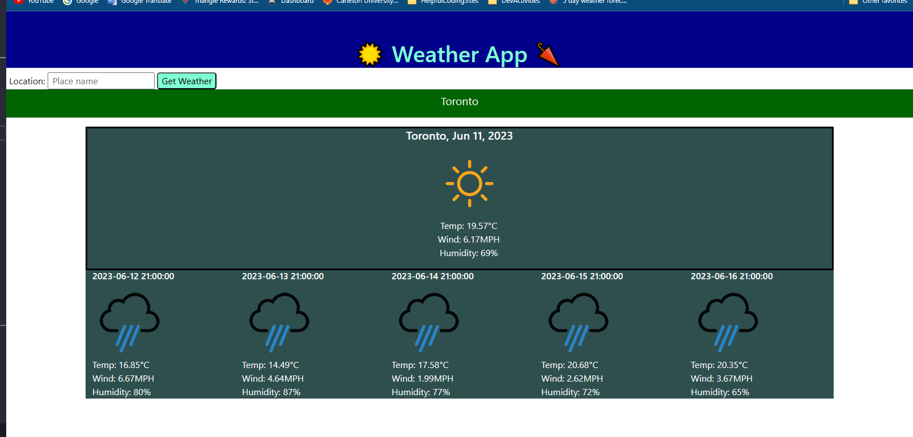

# WeatherApplication

[live site](https://teelsam.github.io/WeatherApplication/)

## Description

Here we have my Weather app which uses an API from OpenWeather to load a 5 day period of weather content for city, which the user types in the search bar.

## Table of Content

A folder of icons for the site to pick from depending on the api weather return.
An index.html file which loads the sites structure.
A script.js file containing the sites javascript functions.
A style.css file containing the sites designs.
and a screen shot of the live site!

## ScreenShot

## Weather-Icons

I sourced the weather icons from github user [yuvraaj](https://github.com/yuvraaaj/openweathermap-api-icons) who lets anyone us them.
